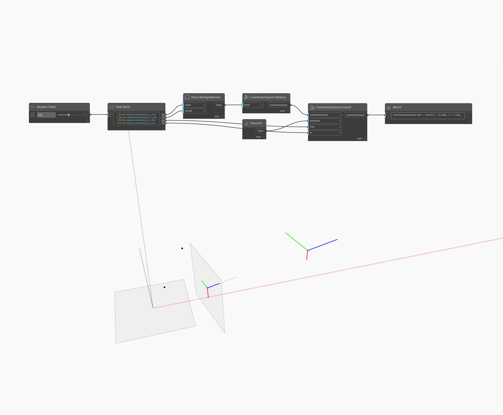

## Description approfondie
Geometry Scale2D met à l'échelle une géométrie dans deux directions à partir d'un plan de base et de deux points de référence. Dans le fichier d'exemple, un cône est mis à l'échelle à partir de son point d'arrivée jusqu'à son centre de gravité par rapport au plan YZ.
___
## Exemple de fichier

