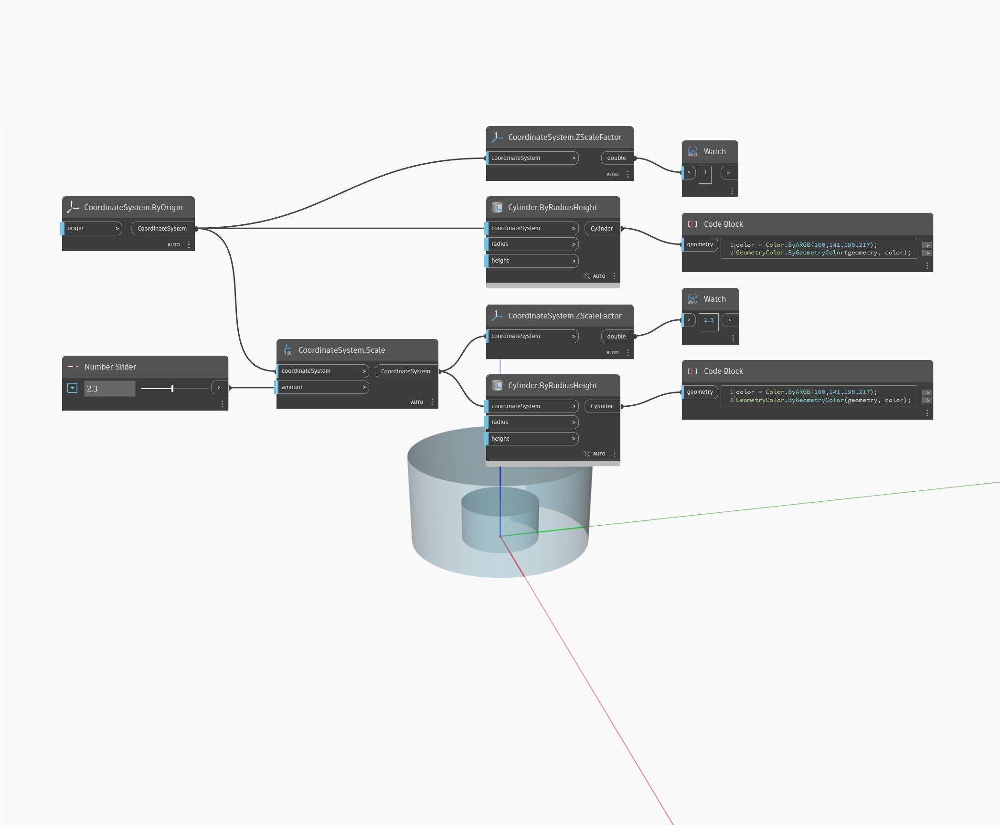

## Description approfondie
ZScaleFactor renvoie un double représentant le facteur d'échelle le long de l'axe Z. Dans l'exemple ci-dessous, un cylindre est mis à l'échelle par 2.3, renvoyant un facteur d'échelle Z de 2.3.
___
## Exemple de fichier

