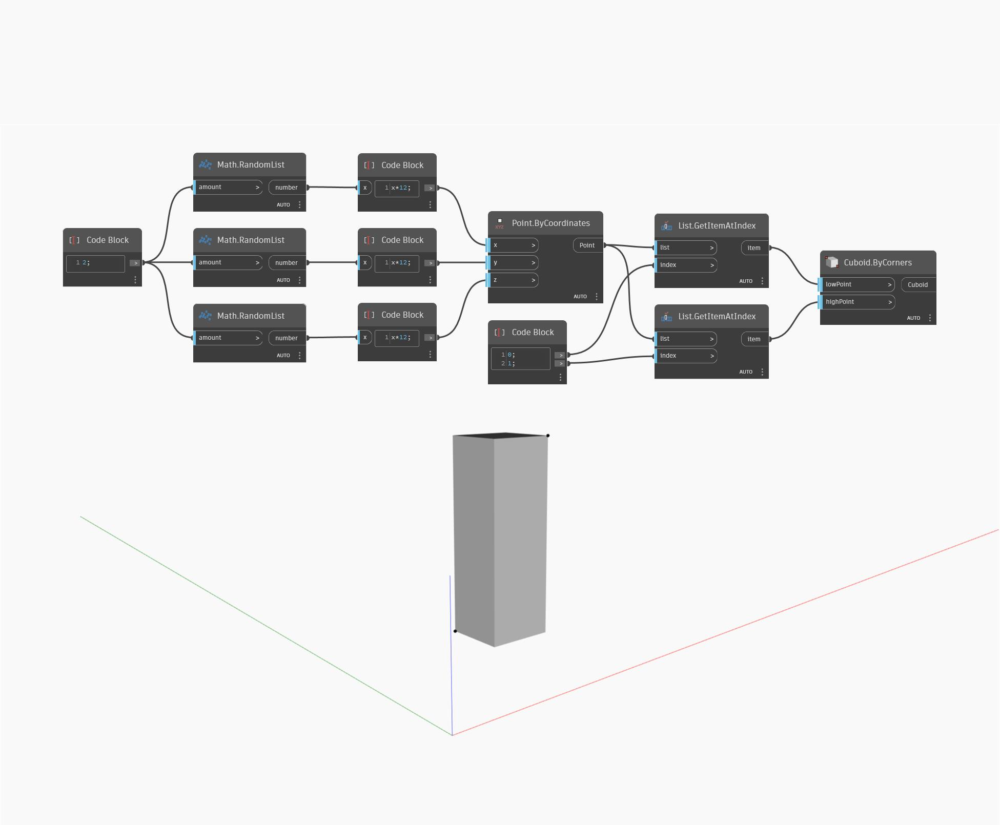

## Description approfondie
Cuboid ByCorners crée un cuboïde dans lequel les deux points d'entrée sont utilisés comme coins opposés du cuboïde. Dans le fichier d'exemple, deux points sont générés de façon aléatoire et utilisés pour créer un cuboïde.
___
## Exemple de fichier

