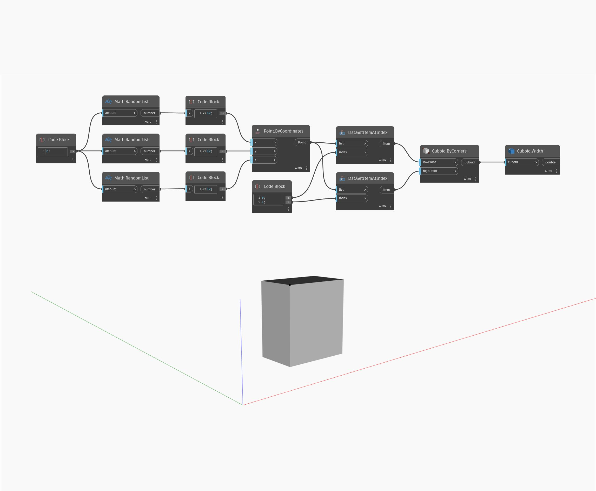

## Description approfondie
`Cuboid.Width` renvoie la largeur du cuboïde d'entrée.

Dans l'exemple ci-dessous, nous générons un cuboïde par coins, puis nous utilisons un noeud `Cuboid.Width` pour trouver sa largeur. Notez que si le cuboïde a été transformé en un système de coordonnées différent avec un facteur d'échelle, cela renvoie la cote d'origine du cuboïde, et non les cotes de l'espace univers.

___
## Exemple de fichier

