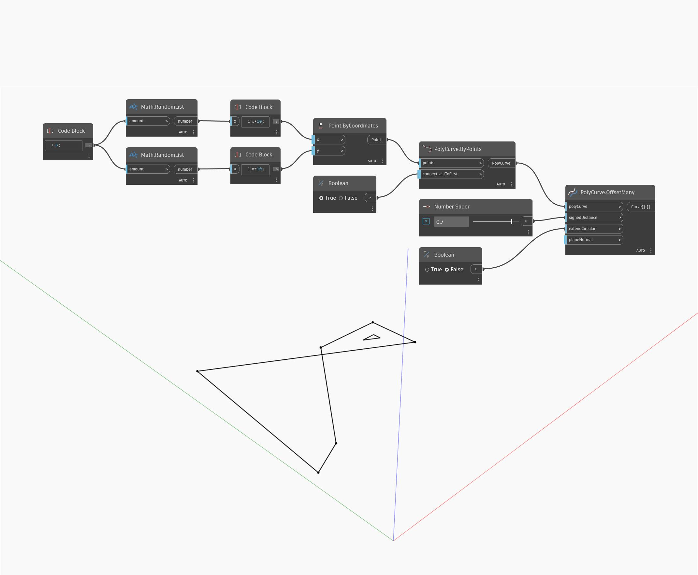

## Description approfondie
Offset crée une nouvelle surface décalée par rapport à la surface d'entrée en fonction de la distance spécifiée par l'entrée de distance. Une distance positive crée la surface décalée en fonction de la direction normale de la surface, tandis qu'une distance négative génère le décalage sur le côté opposé de la surface. Dans l'exemple ci-dessous, nous créons d'abord une surface à l'aide d'un nœud BySweep2Rails. Nous utilisons ensuite un curseur numérique pour contrôler la distance du décalage dans un nœud Offset.
___
## Exemple de fichier

