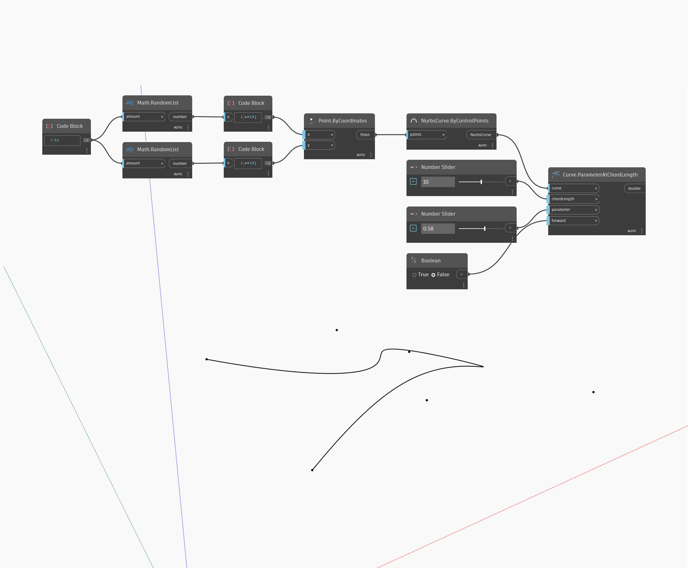

## Description approfondie
ParameterAtChordLength renvoie le paramètre d'un point qui correspond à une longueur de corde donnée à partir d'un paramètre spécifié initialement. Dans l'exemple ci-dessous, nous créons d'abord une courbe Nurbs à l'aide d'un nœud ByControlPoints, avec un ensemble de points générés de façon aléatoire comme entrée. Un curseur numérique est utilisé pour contrôler la distance de corde de ligne droite pour laquelle rechercher un paramètre. Un deuxième curseur numérique défini sur l'intervalle de 0 à 1 est utilisé pour contrôler le point initial le long de la courbe à partir duquel la distance de la corde sera mesurée. Enfin, une bascule booléenne est utilisée pour déterminer la direction à partir de laquelle la distance de corde sera mesurée.
___
## Exemple de fichier

