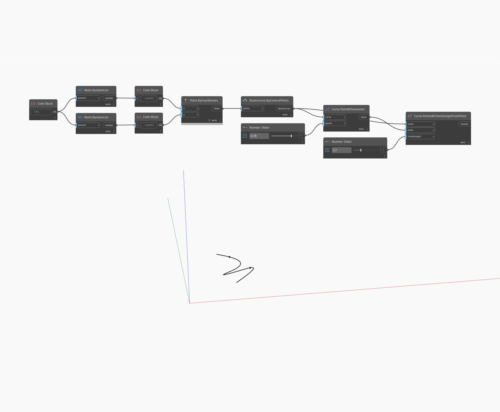

## Description approfondie
PointsAtChordLengthFromPoint renvoie une liste de points le long d'une courbe, mesurée séquentiellement en fonction d'une longueur de corde d'entrée à partir d'un point spécifié le long de la courbe. Dans l'exemple ci-dessous, nous créons d'abord une courbe Nurbs à l'aide d'un nœud ByControlPoints, avec un ensemble de points générés de façon aléatoire comme entrée. Un nœud PointAtParameter est utilisé avec un curseur numérique défini sur l'intervalle de 0 à 1 pour déterminer le point initial sur la courbe pour un nœud PointsAtChordLengthFromPoint. Enfin, un deuxième curseur numérique est utilisé pour ajuster la longueur de corde de ligne droite à utiliser.
___
## Exemple de fichier

