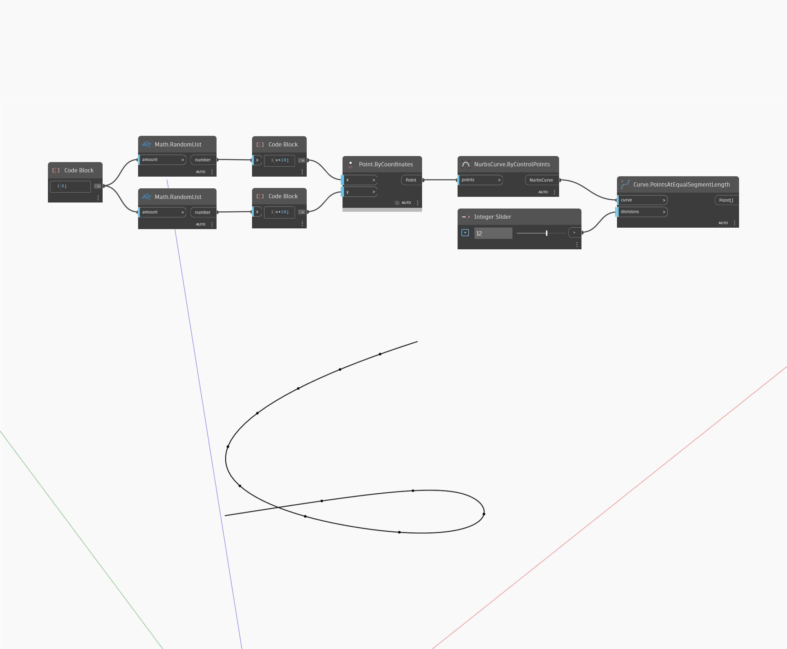

## Description approfondie
PointsAtEqualSegmentLength renvoie une liste de points le long d'une courbe d'entrée en divisant la courbe en segments de longueur égale. Le nombre de divisions à utiliser est entier et entraîne la division égale de ce nombre de points à l'intérieur de la courbe. Ce nœud n'inclut pas les points d'arrivée de la courbe. Dans l'exemple ci-dessous, nous utilisons deux ensembles de nombres aléatoires pour générer une liste de points. Ces points sont utilisés pour créer une courbe Nurbs ByControlPoints. Un curseur de nombres entiesr est utilisé pour l'entrée des divisions dans un nœud PointsAtEqualSegmentLength.
___
## Exemple de fichier

