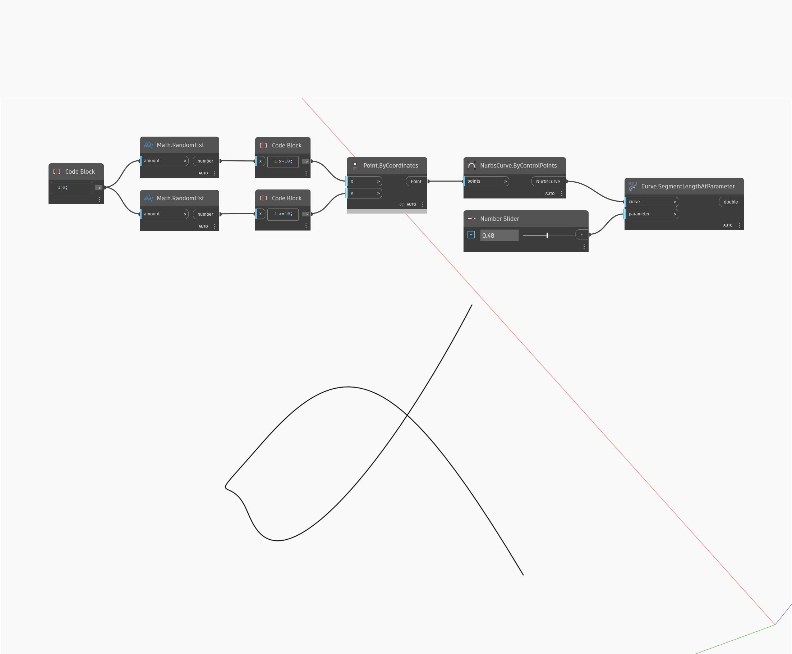

## Description approfondie
SegmentLengthAtParameter renvoie la longueur d'une courbe entre le point de départ et le paramètre d'entrée, où 0 est le paramètre de début de la courbe et 1 est le paramètre de fin de la courbe. Dans l'exemple ci-dessous, nous utilisons deux ensembles de nombres aléatoires pour générer une liste de points. Ces points sont utilisés pour créer une courbe Nurbs ByControlPoints. Un curseur numérique défini sur l'intervalle de 0 à 1 est utilisé pour l'entrée du paramètre dans un nœud SegmentLengthAtParameter.
___
## Exemple de fichier

