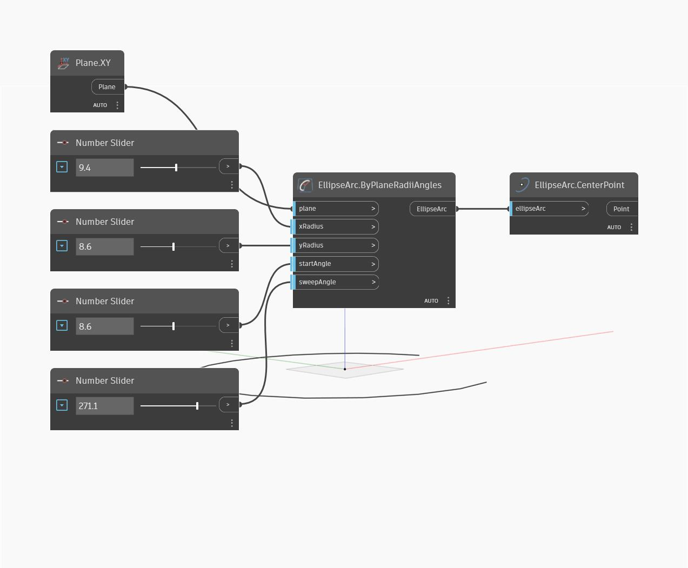

## Description approfondie
`EllipseArc.CenterPoint` trouve le point central d'un arc d'ellipse, qui est identique au point central de l'ellipse terminée.

Dans l'exemple ci-dessous, nous créons d'abord un arc d'ellipse à l'aide du plan XY et d'une série de curseurs numériques. Nous utilisons ensuite le noeud `EllipseArc.CenterPoint` pour extraire le point central de l'ellipse.

___
## Exemple de fichier

