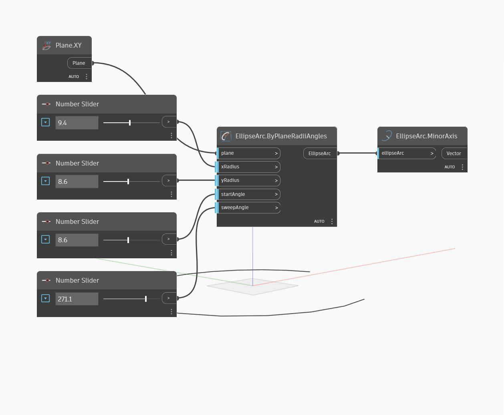

## Description approfondie
MinorAxis renvoie le plus court des deux axes de l'ellipse. L'axe est généré sous forme de vecteur, dont la magnitude est égale au rayon le plus petit des deux. Notez que les axes principal et secondaire sont déterminés par la longueur, et non par la direction. En d'autres termes, l'axe principal peut correspondre au xAxisRadius d'une ellipse, ainsi qu'au yAxisRadius d'une autre ellipse. Dans cet exemple, nous créons d'abord un arc d'ellipse à l'aide du plan XY et d'une série de curseurs numériques. Ensuite, nous utilisons MinorAxis pour extraire l'axe secondaire de l'ellipse.
___
## Exemple de fichier

