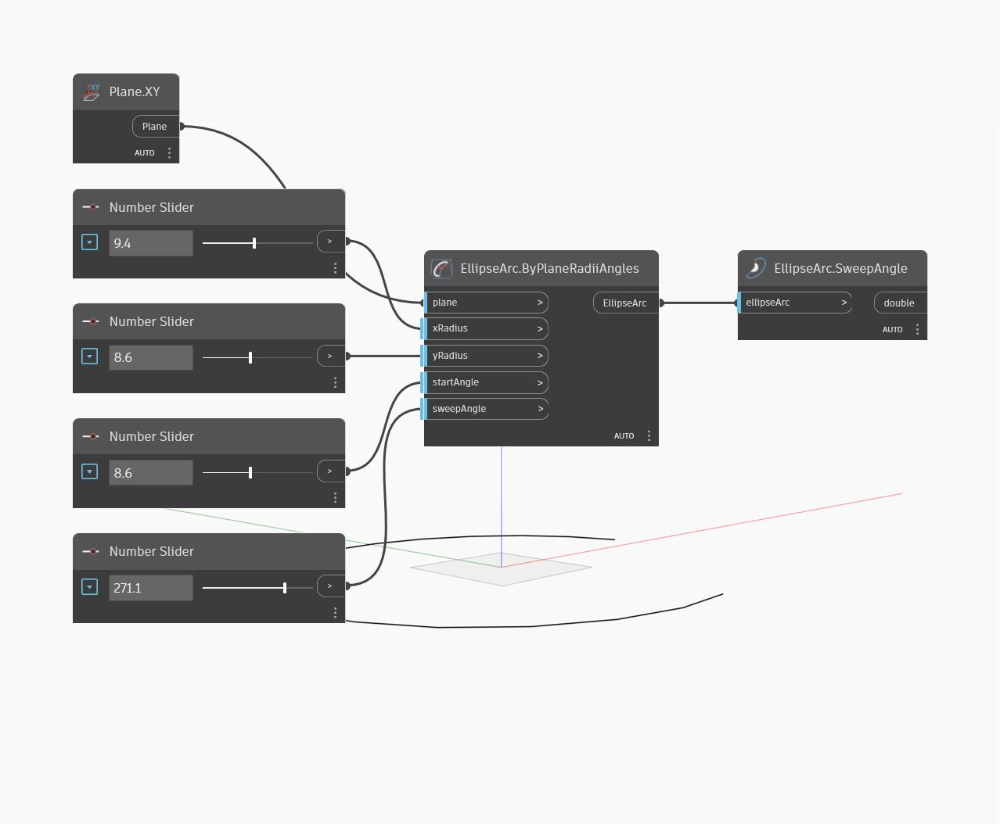

## Description approfondie
SweepAngle détermine l'angle de départ de l'arc d'ellipse. Il est mesuré en degrés dans le sens inverse des aiguilles d'une montre sur le plan d'ellipse, à partir de l'angle de départ. L'angle de fin de l'ellipse est égal à l'angle de départ plus l'angle de balayage. Dans cet exemple, nous créons d'abord un arc d'ellipse à l'aide du plan XY et d'une série de curseurs numériques. Nous utilisons ensuite SweepAngle pour extraire la longueur d'arc de l'arc d'ellipse.
___
## Exemple de fichier

