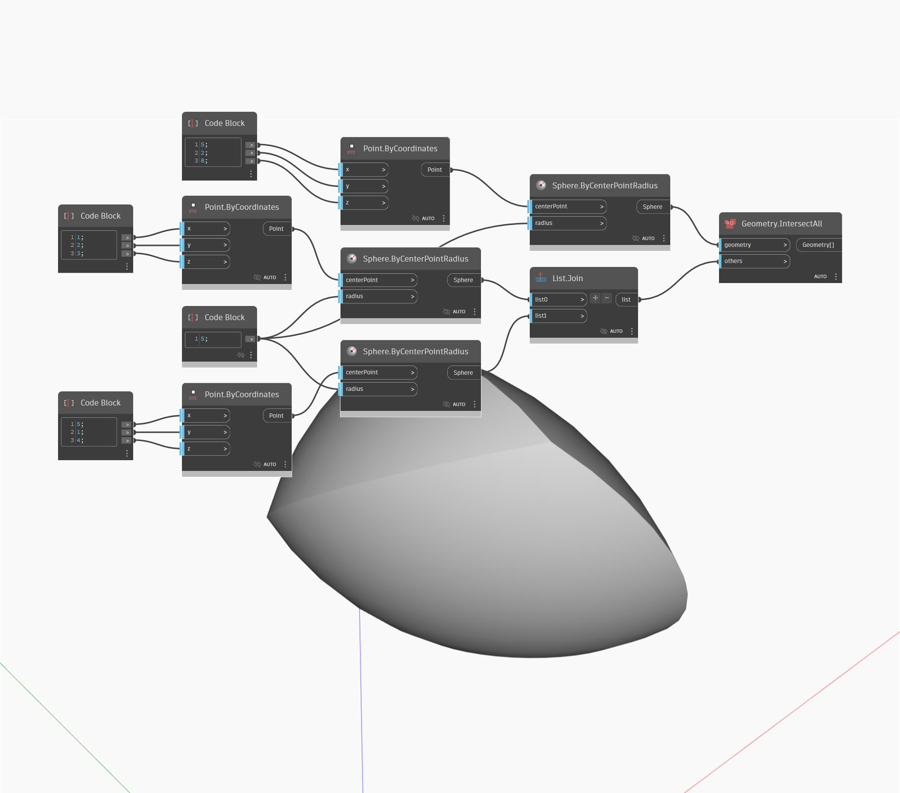

## Description approfondie
Geometry IntersectAll recherche la géométrie d'intersection partagée par un nombre quelconque d'objets de géométrie. Dans cet exemple, l'intersection de trois sphères renvoie une PolySurface, également appelée intersection de solides.
___
## Exemple de fichier

