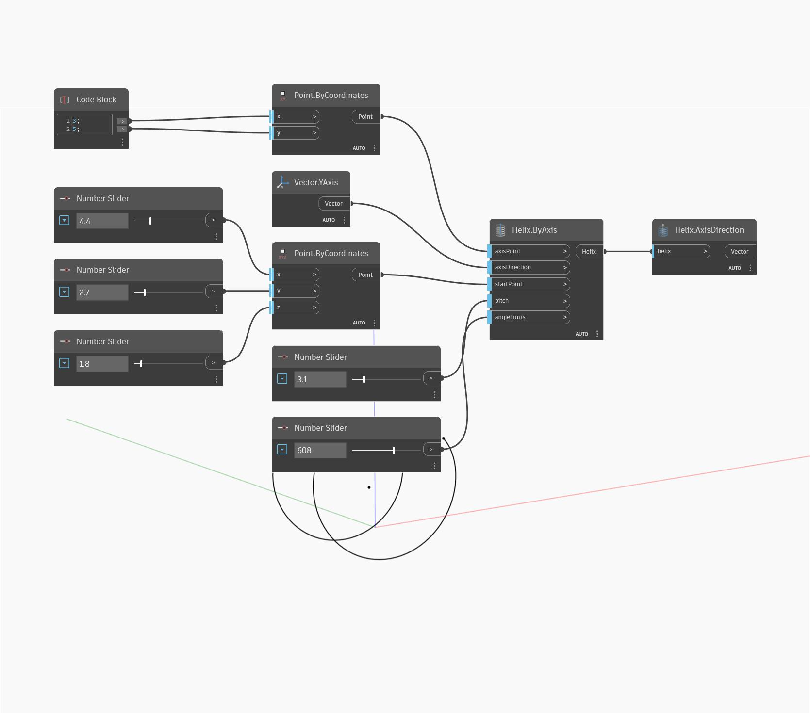

## Description approfondie
AxisDirection renvoie la direction de l'axe central d'une hélice sous forme de vecteur. Avec le nœud AxisPoint, cette option définit l'axe central. Dans l'exemple ci-dessous, nous créons une hélice à l'aide du nœud Helix ByAxis, puis nous utilisons AxisDirection pour obtenir la direction de l'axe de l'hélice.
___
## Exemple de fichier

