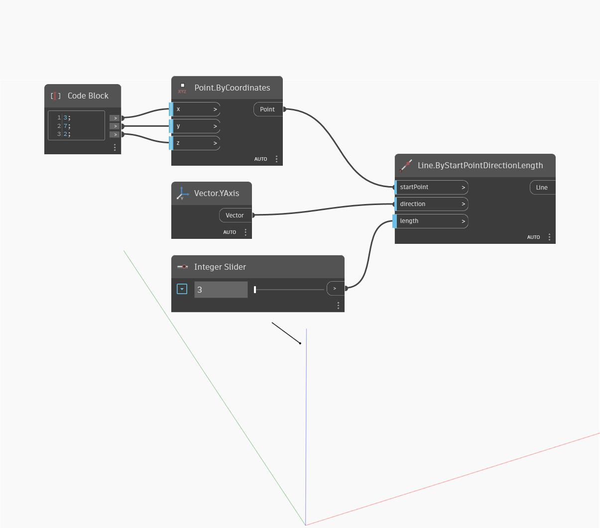

## Description approfondie
Line ByStartPointDirectionLength crée une ligne commençant à l'entrée startPoint, avec une longueur et une direction définies en fonction du vecteur et de la longueur de direction d'entrée. Dans l'exemple ci-dessous, nous utilisons un Code Block pour spécifier les coordonnées x, y et z d'un point. Nous utilisons ensuite un curseur numérique pour contrôler la longueur de la ligne.
___
## Exemple de fichier

