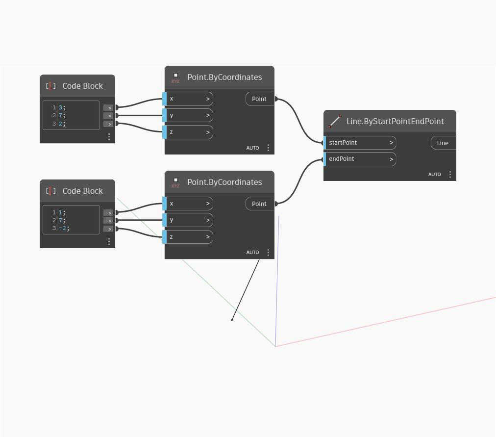

## Description approfondie
`Line.ByStartPointEndPoint` crée une ligne entre deux points d'entrée.

Dans l'exemple ci-dessous, nous utilisons deux Code Blocks pour spécifier les coordonnées X, Y et Z de deux points, puis nous créons une ligne entre les deux points.

___
## Exemple de fichier

