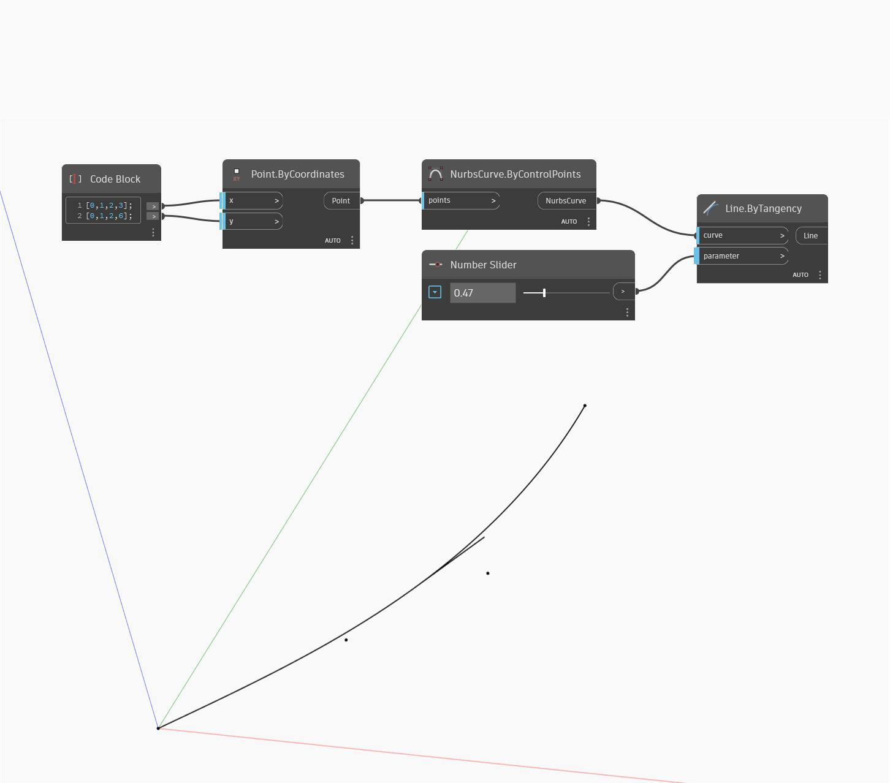

## Description approfondie
Line ByTangency crée une ligne tangente à une courbe d'entrée et d'une longueur de 1 unité. L'entrée de paramètre spécifie la position le long de la courbe à évaluer, avec un paramètre de 0 étant le début de la courbe et une valeur de 1 la fin de la courbe. Dans cet exemple, nous utilisons un Code Block pour générer deux listes correspondant aux emplacements X et Y d'une série de points. Les points sont utilisés pour dessiner une courbe Nurbs. Nous utilisons ensuite un curseur numérique compris entre 0 et 1 comme paramètre d'entrée pour créer une ligne tangente à la courbe.
___
## Exemple de fichier

