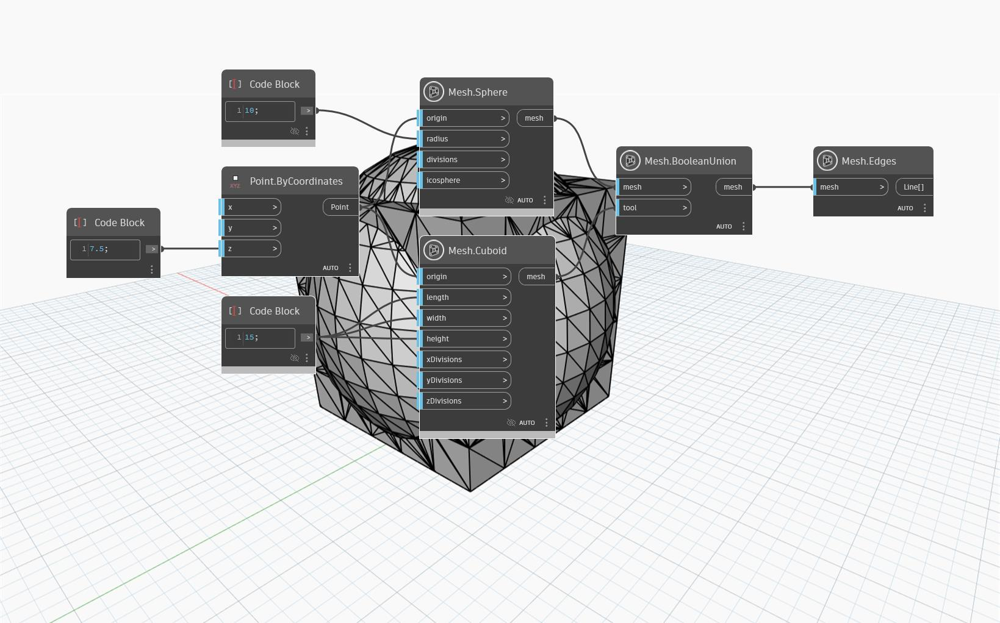

## Détails
Le nœud 'Mesh.BooleanUnion' renvoie l'union des deux maillages d'entrée après leur jonction en un seul maillage et la suppression des parties des maillages qui se chevauchent.
Dans l'exemple ci-dessous, nous utilisons 'Mesh.BooleanUnion' pour unir deux maillages, 'Mesh.Sphere' et 'Mesh.Cuboid'.

('Mesh.Edges' permet de visualiser la structure du maillage.)

## Exemple de fichier

