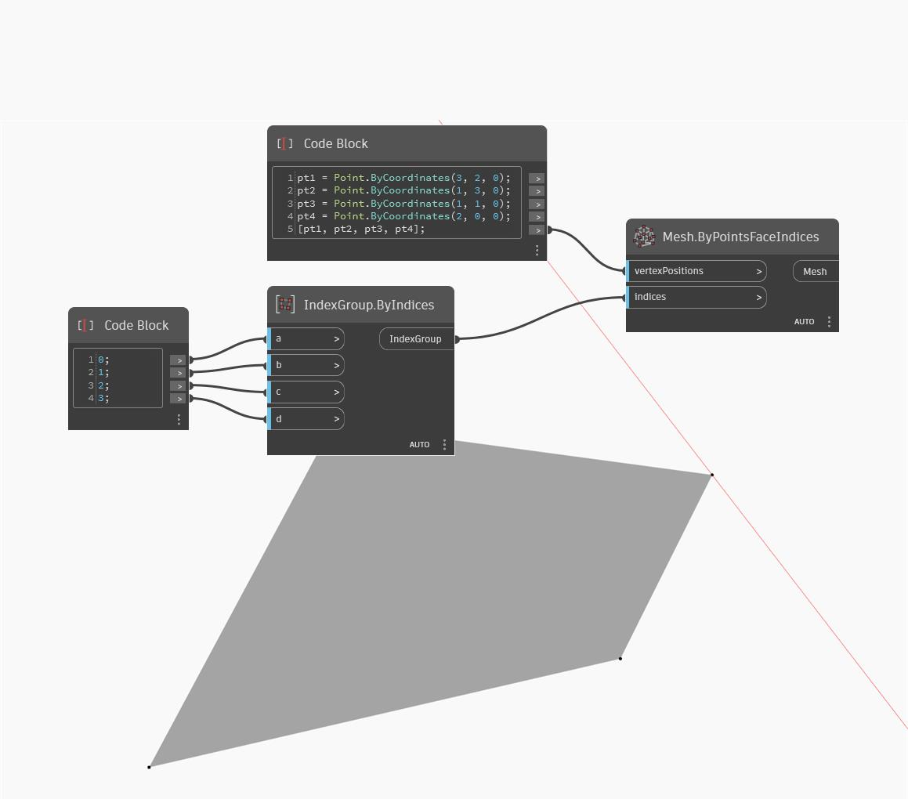

## Description approfondie
ByPointsFaceIndices renvoie un maillage basé sur les sommets d'entrée en tant que points et index d'entrée. Dans l'exemple ci-dessous, un maillage à quatre côtés est créé avec quatre points et un IndexGroup de quatre index.
___
## Exemple de fichier

