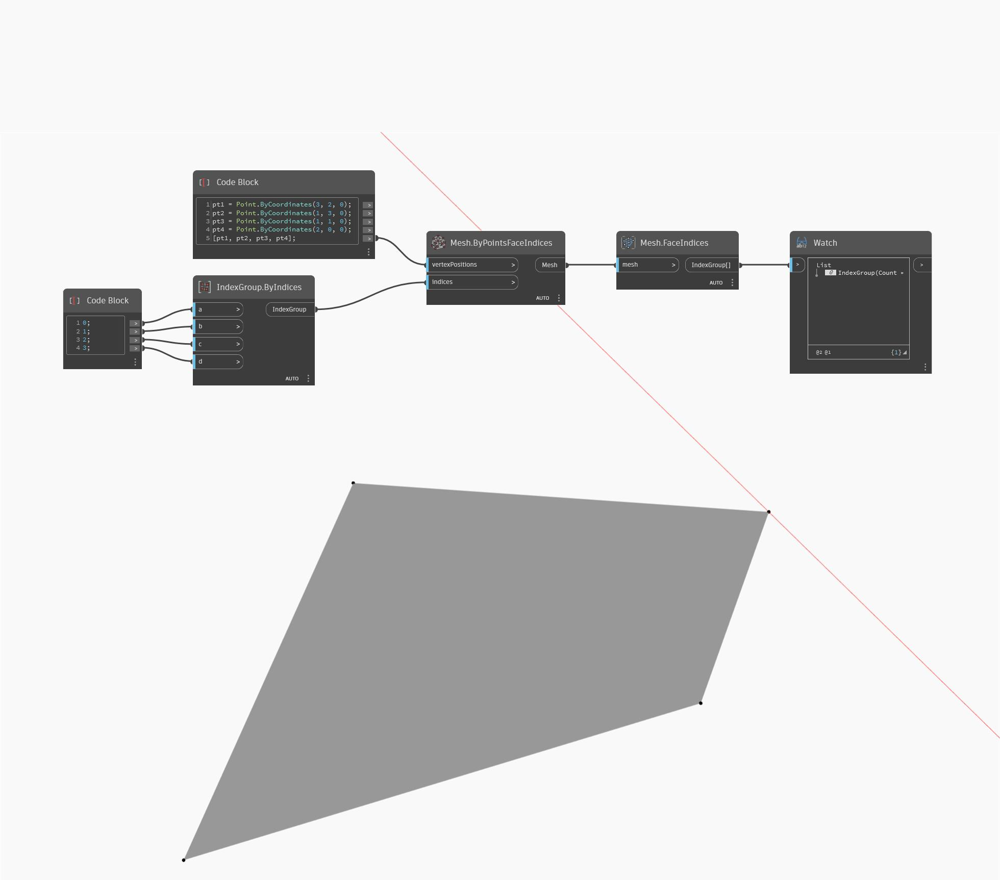

## Description approfondie
FaceIndices renvoie l'IndexGroup d'une face maillée dans le sens inverse des aiguilles d'une montre. Dans l'exemple ci-dessous, un IndexGroup est renvoyé pour une face maillée à quatre côtés.
___
## Exemple de fichier

