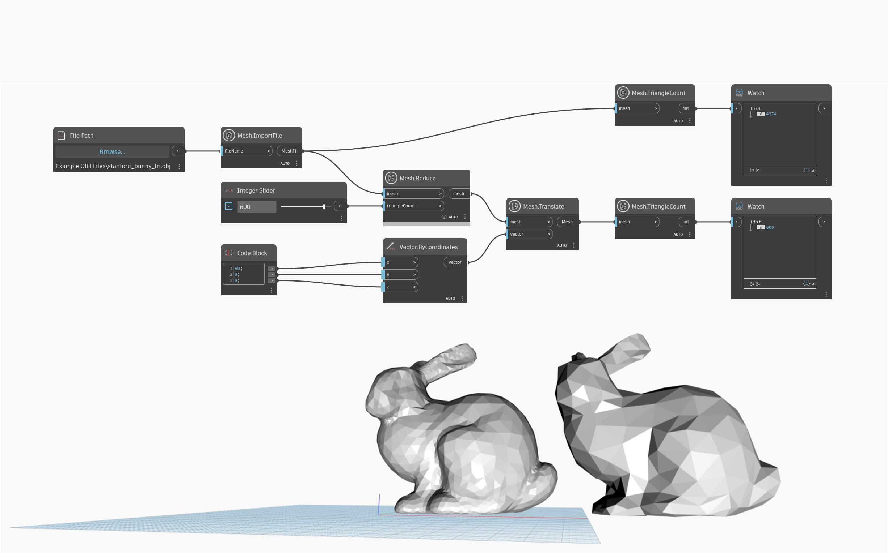

## Détails
'Mesh.Reduce' crée un maillage avec un nombre réduit de triangles. L'entrée 'triangleCount' définit le nombre cible de triangles du maillage de sortie. Notez que 'Mesh.Reduce' peut modifier de manière significative la forme du maillage en cas de cibles 'triangleCount' extrêmement agressives. Dans l'exemple ci-dessous, 'Mesh.ImportFile' est utilisé pour importer un maillage, qui est ensuite réduit par le noeud 'Mesh.Reduce' et transposé dans une autre position pour un meilleur aperçu et une meilleure comparaison.

## Exemple de fichier

