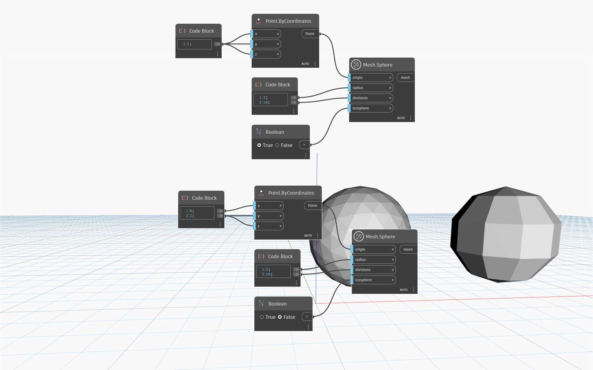

## Détails
'Mesh.Sphere' crée une sphère maillée, centrée au nivesu du point 'origin' d'entrée, avec un 'rayon' donné et un nombre de 'divisions'. L'entrée booléenne 'icosphere' est utilisée pour basculer entre les types de maillage sphérique 'icosphere' et 'UV-Sphere'. Un maillage d'icosphère recouvre la sphère de triangles plus réguliers qu'un maillage UV et tend à donner de meilleurs résultats lors des opérations de modélisation en aval. Les pôles d'un maillage UV sont alignés avec l'axe de la sphère et les couches de triangle sont générées longitudinalement autour de l'axe.

Dans le cas de l'icosphère, le nombre de triangles autour de l'axe de la sphère pourrait être aussi faible que le nombre spécifié de divisions et au maximum le double de ce nombre. Les divisions d'une sphère UV déterminent le nombre de couches de triangles générées longitudinalement autour de la sphère. Lorsque l'entrée 'divisions' est définie sur zéro, le noeud renvoie une sphère UV avec un nombre par défaut de 32 divisions pour l'un ou l'autre type de maillage.

Dans l'exemple ci-dessous, le noeud 'Mesh.Sphere' est utilisé pour créer deux sphères avec un rayon et des divisions identiques, mais à l'aide de méthodes différentes. Lorsque l'entrée 'icosphere' est définie sur 'True', 'Mesh.Sphere' renvoie une icosphère. Alternativement, lorsque l'entrée 'icosphere' est définie sur 'False', le noeud 'Mesh.Sphere' renvoie une sphère UV.

## Exemple de fichier

