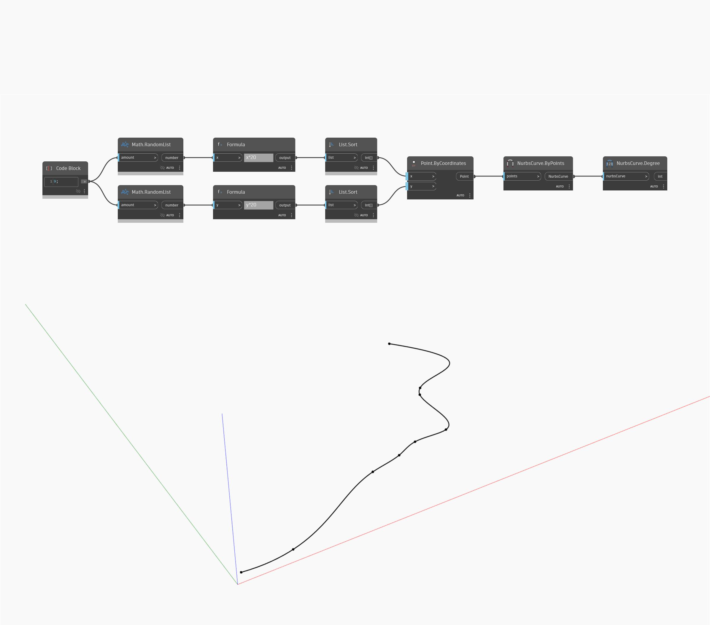

## Description approfondie
Degree renvoie le degré d'une courbe Nurbs. Dans cet exemple, nous générons d'abord un certain nombre de points aléatoires, puis nous utilisons NurbsCurve ByPoints pour créer une courbe interpolée via les points. Nous pouvons utiliser Degree pour obtenir le degré de la courbe. Comme nous avons créé la courbe sans en spécifier le degré, elle utilise un degré par défaut de 3. (Une courbe polygonale de lignes droites a un degré de 1, tandis que le degré le plus commun pour les courbes non segmentées droites est de 3)
___
## Exemple de fichier

