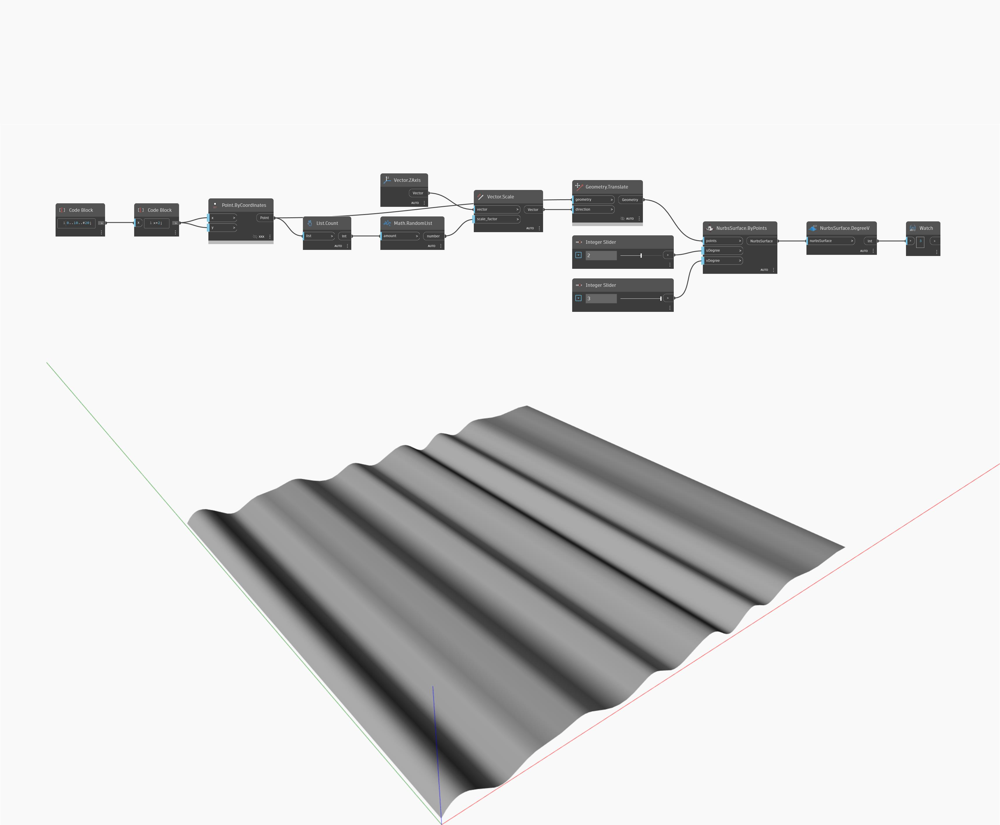

## Description approfondie
DegreeV renvoie le degré d'une NurbsSurface dans la direction V. Dans l'exemple ci-dessous, une NurbsSurface créée avec des points et des degrés U/V spécifiés possède un degré de 2 dans la direction V. L'ajustement des curseurs numériques modifie les valeurs des degrés U et V.
___
## Exemple de fichier

