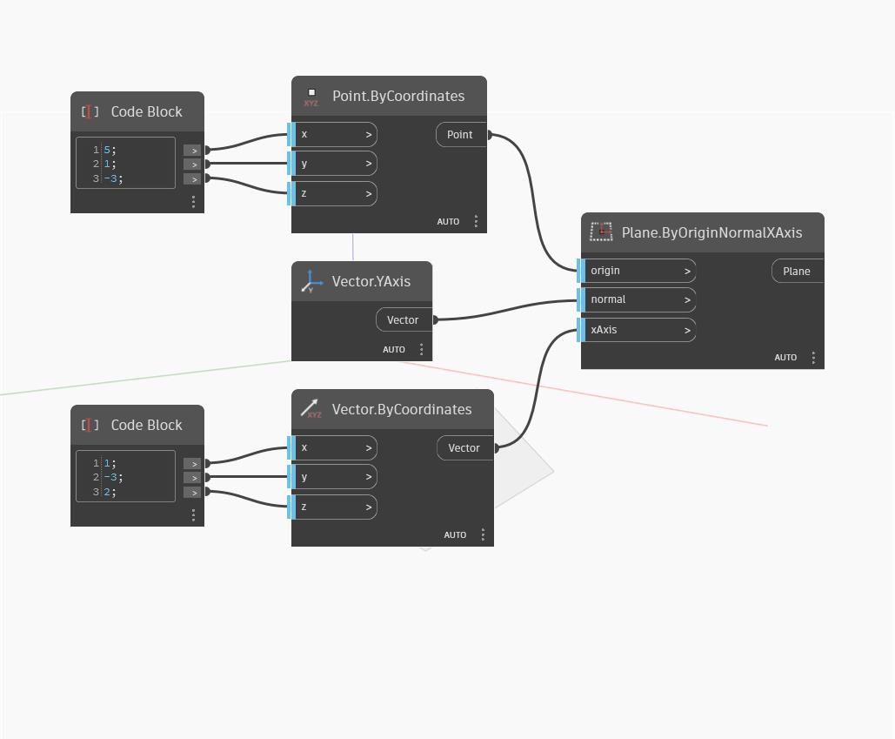

## Description approfondie
Plane ByOriginNormalXAxis est similaire à Plane ByOriginNormal, mais permet également d'entrer une direction pour l'axe X afin de contrôler l'orientation du plan. Si le vecteur d'entrée xAxis n'est pas dans le plan défini par l'origine et les entrées normales, il est d'abord projeté sur le plan pour déterminer l'XAxis du plan. Dans l'exemple ci-dessous, nous utilisons l'YAxis du SCG comme vecteur normal et deux Code Blocks pour définir le point d'origine et l'xAxis d'entrée.
___
## Exemple de fichier

