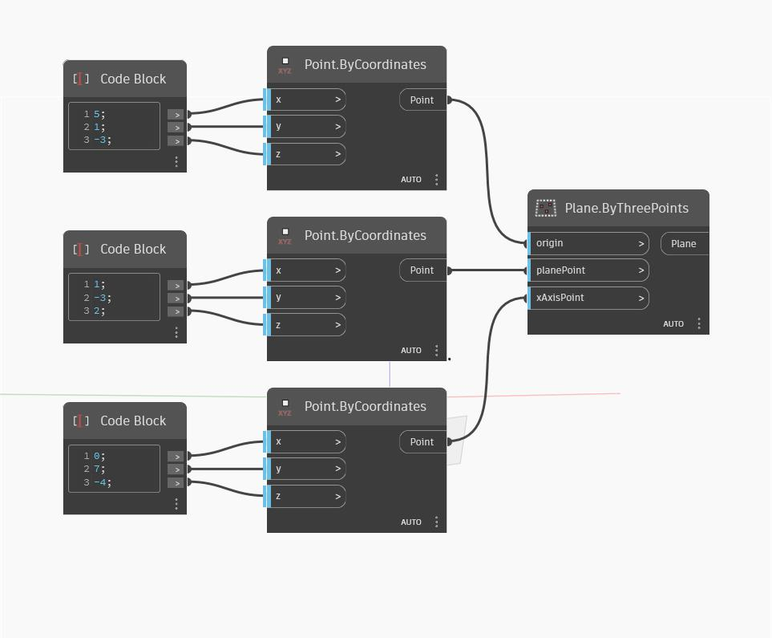

## Description approfondie
Plane ByThreePoints crée un plan qui passe par les trois points d'entrée. Les points ne doivent pas être colinéaires. Dans l'exemple ci-dessous, nous utilisons trois Code Blocks pour définir les trois points initiaux, puis nous utilisons ByThreePoints pour créer un plan.
___
## Exemple de fichier

