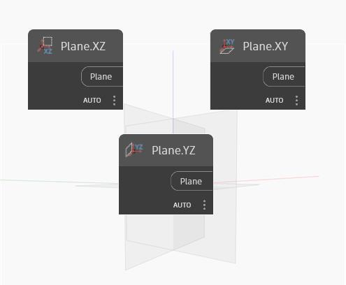

## Description approfondie
Plane XY crée un plan dans les directions XY du SCG. La normale de ce plan est l'axe Z du SCG. Dans le fichier d'exemple, nous montrons les plans XY, YZ et XZ. Dans l'image, le plan XY est en surbrillance.
___
## Exemple de fichier

