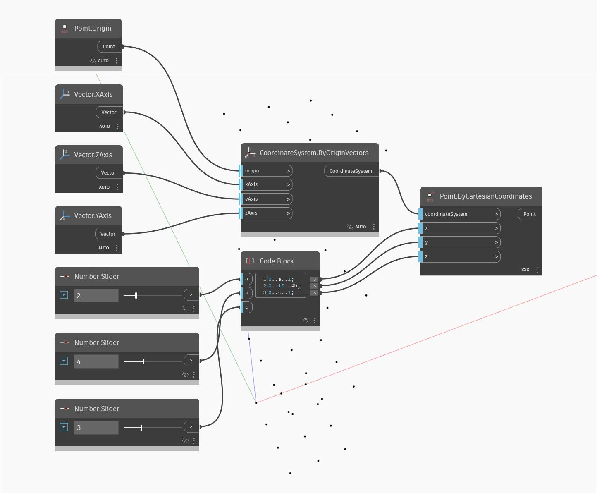

## Description approfondie
Point ByCartesianCoordinates permet de définir les valeurs X, Y et Z de l'emplacement d'un point. Dans cet exemple, nous définissons plusieurs intervalles de Code Blocks contrôlés par des curseurs pour gérer le réseau de points en trois dimensions.
___
## Exemple de fichier

