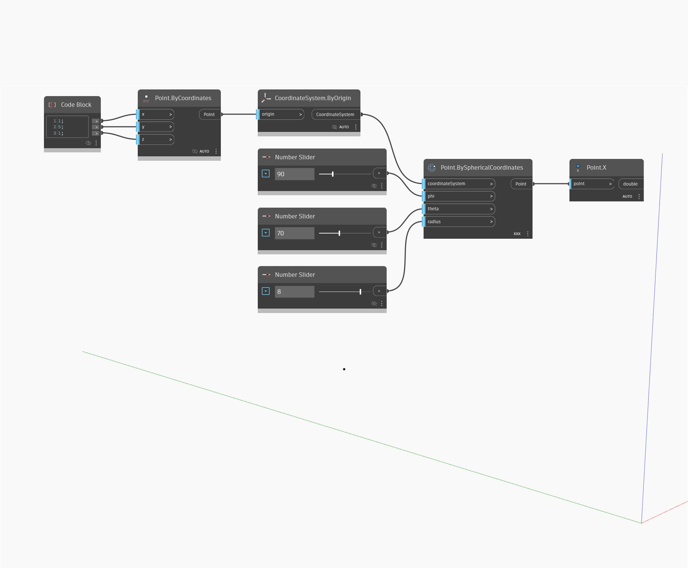

## Description approfondie
`Point.X` renvoie la valeur X de l'espace univers d'un point d'entrée.

Dans l'exemple ci-dessous, nous utilisons `Point.BySphericalCoordinates` pour créer un point, puis nous utilisons `Point.X` pour renvoyer sa coordonnée X.

___
## Exemple de fichier

