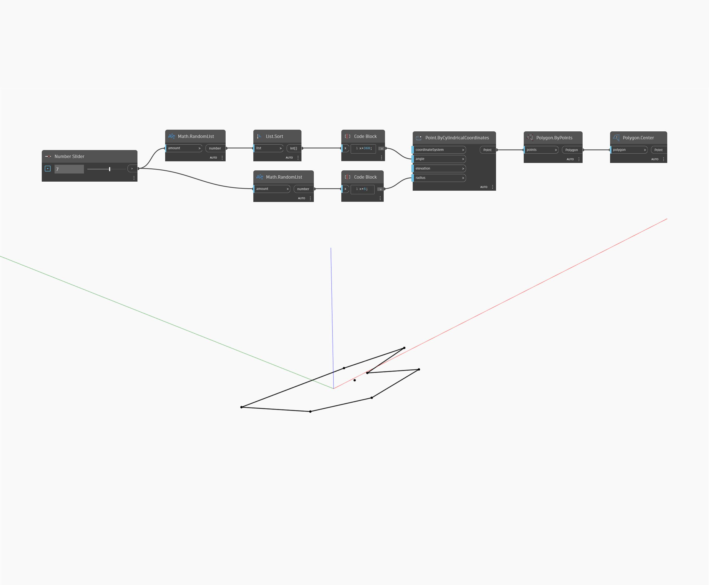

## Description approfondie
Polygon Center permet de trouver le centre d'un polygone donné en prenant en compte la valeur moyenne des coins. Pour les polygones concaves, il est possible que le centre se trouve en dehors du polygone. Dans l'exemple ci-dessous, nous générons d'abord une liste d'angles et de rayons aléatoires à utiliser comme entrées pour Point ByCylindricalCoordinates. En triant les angles en premier, nous nous assurons que le polygone obtenu sera connecté par ordre d'angle croissant, et ne sera donc pas auto-sécant. Nous pouvons ensuite utiliser Center pour prendre la moyenne des points afin de trouver le centre du polygone.
___
## Exemple de fichier

