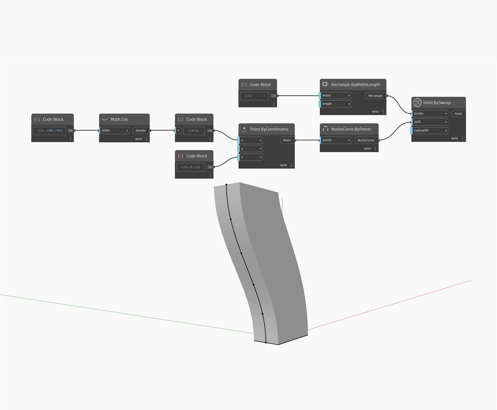

## Description approfondie
Surface BySweep crée une surface par balayage d'une courbe d'entrée le long d'une trajectoire spécifiée. Dans l'exemple ci-dessous, nous utilisons une courbe sinusoïdale dans la direction Y comme courbe de profil. Nous faisons pivoter cette courbe de -90 degrés autour de l'axe Z du SCG pour l'utiliser comme courbe de trajectoire. Surface BySweep déplace la courbe de profil le long de la courbe de trajectoire pour créer une surface.
___
## Exemple de fichier

