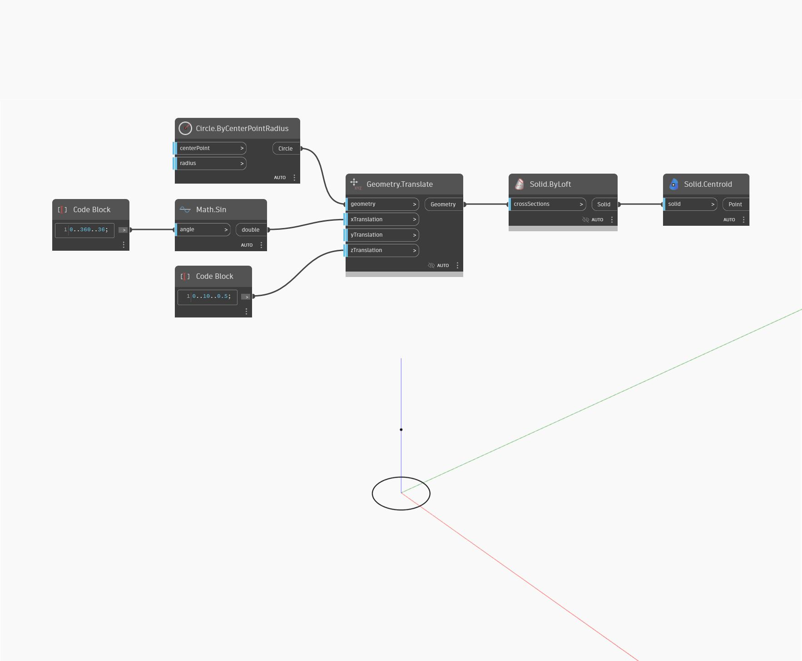

## Description approfondie
Centroid renvoie un point situé au centre de gravité d'un solide. Cela peut être considéré comme le centre de gravité d'un objet solide. Notez qu'il est possible que le centre de gravité se trouve en dehors du solide réel. Dans l'exemple ci-dessous, nous utilisons un ensemble de cercles pour créer un Solid ByLoft et entrons le solide obtenu dans un nœud Centroid.
___
## Exemple de fichier

