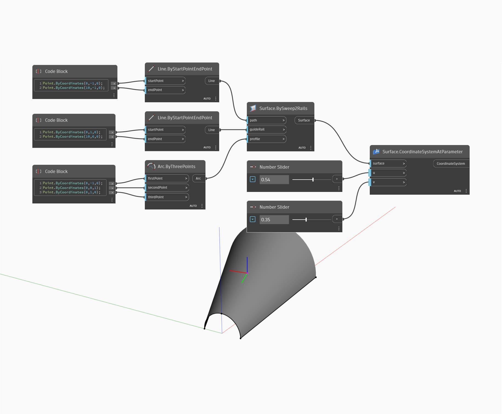

## Description approfondie
CoordinateSystemAtParameter utilise les paramètres d'entrée U et V et renvoie un système de coordonnées. Les axes X, Y et Z du système de coordonnées sont déterminés respectivement par la direction normale, la direction U et la direction V. Dans l'exemple ci-dessous, nous créons d'abord une surface à l'aide d'un BySweep2Rails. Nous utilisons ensuite deux curseurs numériques pour définir les paramètres U et V afin de créer un système de coordonnées avec un nœud CoordinateSystemAtParameter.
___
## Exemple de fichier

