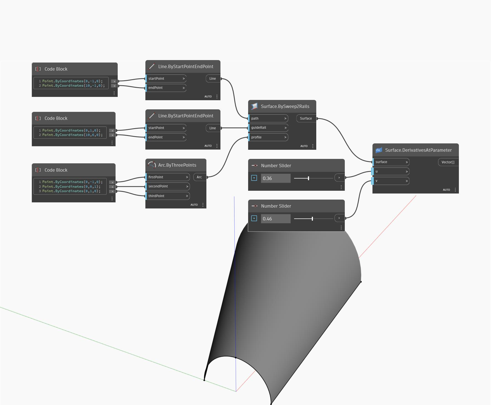

## Description approfondie
DerivativesAtParameter utilise les paramètres d'entrée U et V et renvoie les dérivées U et V de la surface à la position UV d'entrée sur la surface. Les dérivées sont renvoyées sous la forme d'une liste de deux vecteurs, le premier vecteur étant la dérivée U et le second vecteur étant la dérivée V. Dans l'exemple ci-dessous, nous créons d'abord une surface à l'aide d'un nœud BySweep2Rails. Nous utilisons ensuite deux curseurs numériques pour déterminer les paramètres U et V afin d'obtenir les dérivées avec un nœud DerivativesAtParameter.
___
## Exemple de fichier

