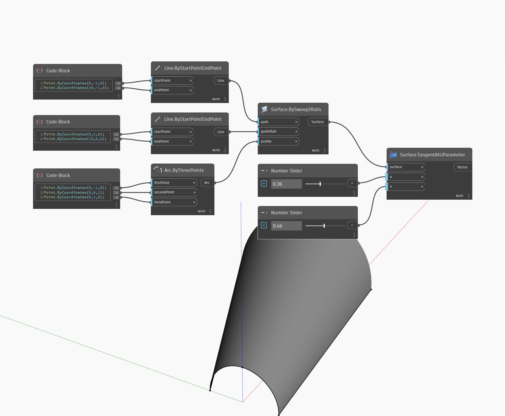

## Description approfondie
TangentAtUParameter renvoie le vecteur de tangente dans la direction U à une position UV spécifiée sur une surface. Dans l'exemple ci-dessous, nous créons d'abord une surface à l'aide d'un nœud BySweep2Rails. Nous utilisons ensuite deux curseurs numériques pour déterminer les paramètres U et V afin de trouver le vecteur de tangente U.
___
## Exemple de fichier

