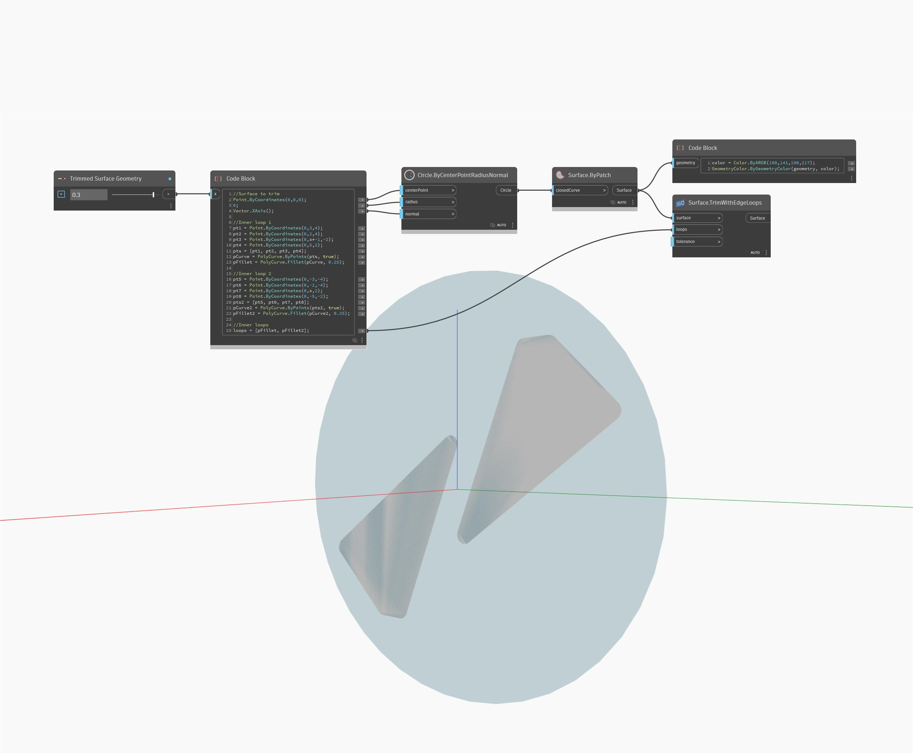

## Description approfondie
TrimWithEdgeLoops renvoie une nouvelle surface ajustée à partir d'une surface d'entrée. Dans l'exemple ci-dessous, deux boucles sont ajustées à partir d'une surface, renvoyant deux nouvelles surfaces mises en surbrillance en bleu. Le curseur numérique permet d'ajuster la forme des nouvelles surfaces. L'entrée des boucles indique une seule PolyCurve ou une liste d'entre elles.
___
## Exemple de fichier

