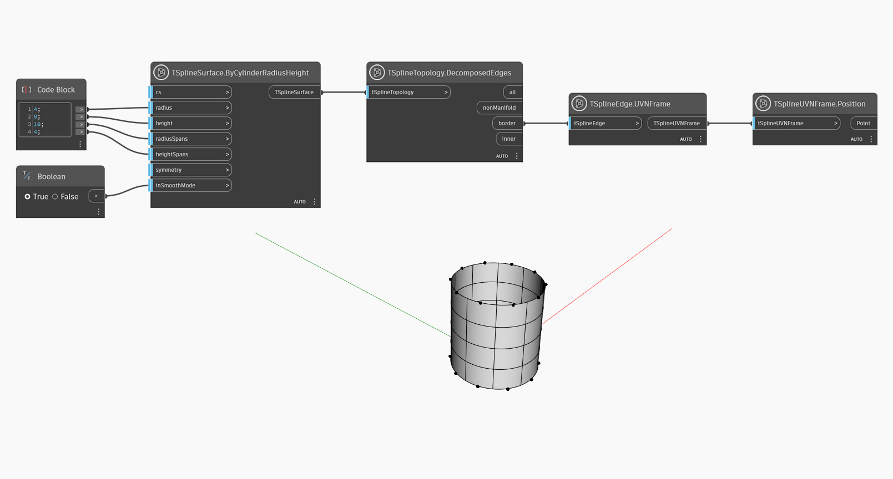

## In-Depth
Dans l'exemple ci-dessous, les noeuds `TSplineEdge.UVNFrame` et `TSplineUVNFrame.Position` sont utilisés pour afficher un aperçu de la position des arêtes de bordure d'une surface de T-Spline.

## Exemple de fichier

