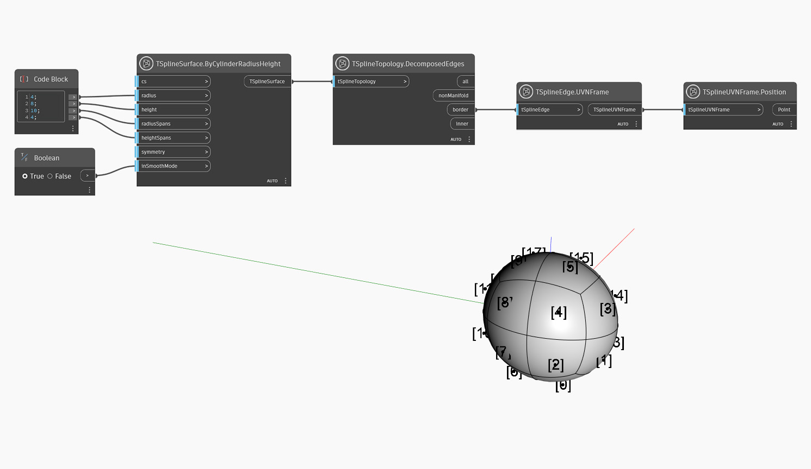

## In-Depth
Un cadre UVN d'une face fournit des informations utiles sur la position et l'orientation de la face en renvoyant le vecteur normal et les directions UV.
Dans l'exemple ci-dessous, un noeud `TSplineFace.UVNFrame` est utilisé pour visualiser la distribution des faces sur une primitive quadball. `TSplineTopology.DecomposedFaces` est utilisée pour interroger toutes les faces et un noeud `TSplineFace.UVNFrame` est ensuite utilisé pour extraire les positions des centres de gravité de face en tant que points. Les points sont visualisés à l'aide d'un noeud `TSplineUVNFrame.Position`. Les étiquettes sont affichées dans l'aperçu en arrière-plan en activant l'option Afficher les étiquettes dans le menu contextuel du noeud.

## Exemple de fichier

