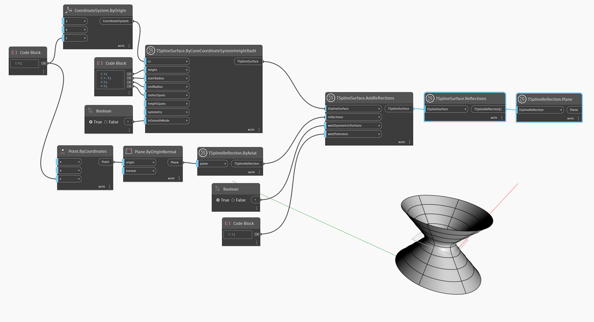

## In-Depth
`TSplineInitialReflection.Plane` indique le plan autour duquel la réflexion est effectuée initialement.

Dans l'exemple ci-dessous, `TSplineSurface.Reflections` est utilisé pour interroger les réflexions appliquées à une surface de T-Spline d'entrée. `TSplineReflection.Plane` est ensuite utilisé pour renvoyer le plan qui a été utilisé pour effectuer la réflexion.

## Exemple de fichier

