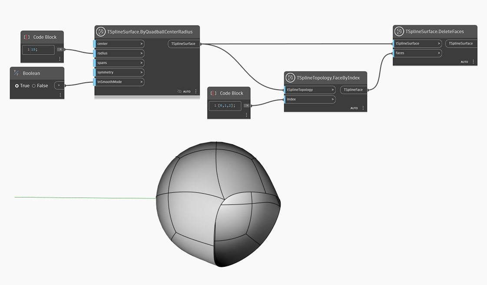

## Description approfondie

Dans l'exemple ci-dessous, une surface de T-Spline de primitive de quadball est créée à l'aide du noeud `TSplineSurface.ByQuadballCenterRadius`. Un jeu de faces est sélectionné avec le noeud `TSplineTopology.FaceByIndex` et fourni comme entrée dans le noeud `TSplineSurface.DeleteFaces`.

## Exemple de fichier

