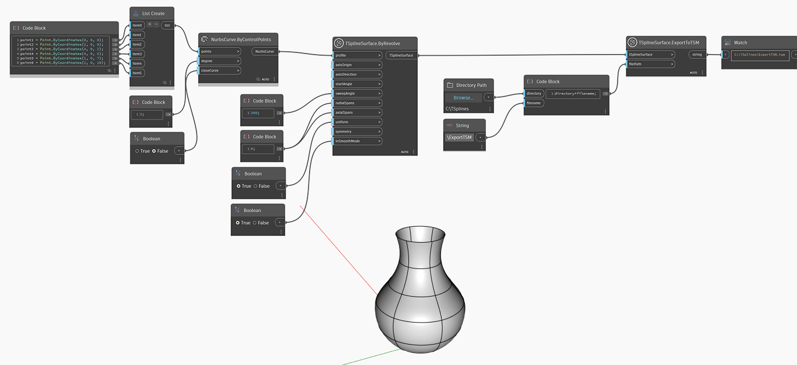

## Description approfondie
Dans l'exemple ci-dessous, une surface de T-Spline est créée à l'aide de `TSplineSurface.ByRevolve`, avec une courbe NURBS en tant que profil.
Si un chemin de fichier est indiqué, la surface est ensuite exportée vers un fichier de maillage de T-Spline via le noeud `TSplineSurface.ExportToTSM`.
___
## Exemple de fichier

