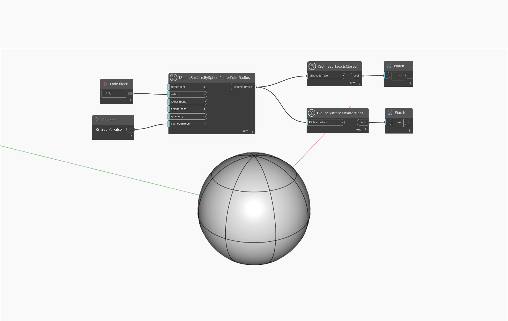

## Description approfondie
Les surfaces T-Spline étanches sont des géométries qui, si elles sont immergées dans un liquide, ne laissent pas les fluide y pénétrer.

Dans l'exemple ci-dessous, le noeud `TSplineSurface.IsWaterTight` est utilisé sur une primitive de sphère de T-Spline, renvoyant la valeur `true`. Cela illustre un des cas où une surface de T-Spline, bien qu'ouverte (les sommets n'étant pas soudés aux pôles de la sphère), est étanche.
___
## Exemple de fichier

