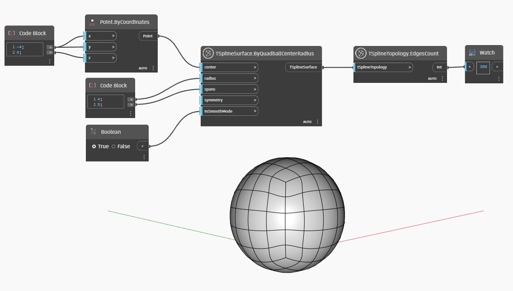

## Description approfondie
Dans l'exemple ci-dessous, `TSplineTopology.EdgesCount` est utilisé pour compter les arêtes d'un Quadball créé par un noeud `TSplineSurface.ByQuadballCenterRadius`.
___
## Exemple de fichier

