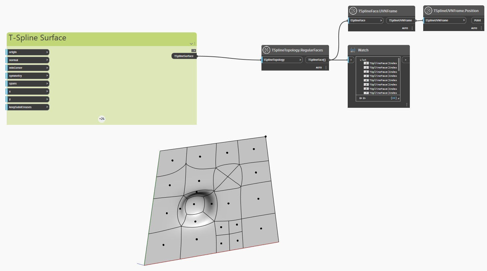

## Description approfondie
Dans l'exemple ci-dessous, une surface de T-Spline plane avec des sommets et des faces extrudés, subdivisés et étirés est inspectée avec le noeud `TSplineTopology.RegularFaces`.

Les noeuds `TSplineFace.UVNFrame` et `TSplineUVNFrame.Position` sont utilisés pour mettre en surbrillance le centre des faces régulières de la surface.
___
## Exemple de fichier

