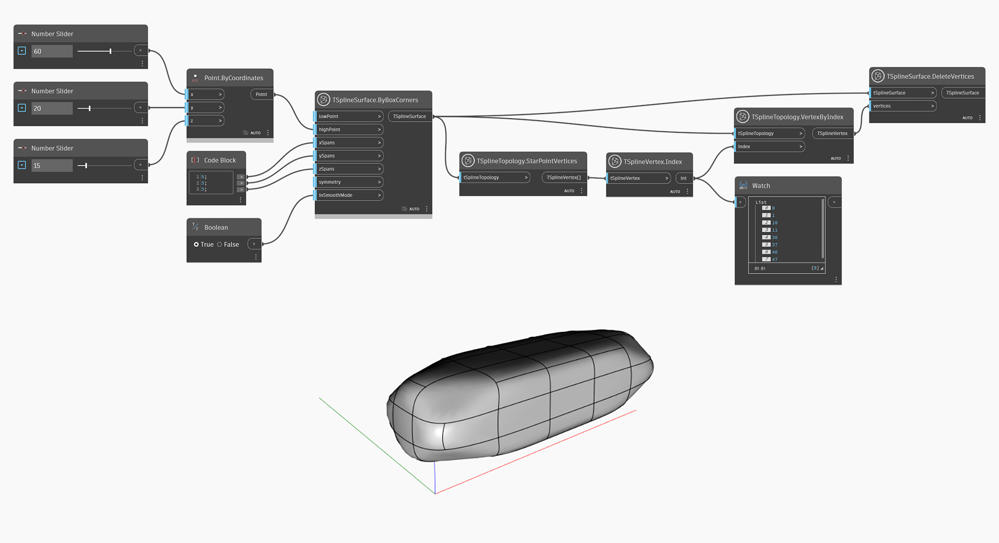

## In-Depth
`TSplineVertex.Index` renvoie le numéro d'index du sommet choisi sur la surface de T-spline. Notez que dans une topologie de surface de T-Spline, les index de face, d'arête et de sommet ne coïncident pas nécessairement avec le numéro de séquence de l'élément dans la liste. Utilisez le noeud `TSplineSurface.CompressIndices` pour résoudre ce problème.

Dans l'exemple ci-dessous, `TSplineTopology.StarPointVertices` est utilisé sur une primitive de T-Spline en forme de boîte. `TSplineVertex.Index` est ensuite utilisé pour interroger les index des sommets en point d'étoile et `TSplineTopology.VertexByIndex` renvoie les sommets sélectionnés pour modification ultérieure.

## Exemple de fichier

