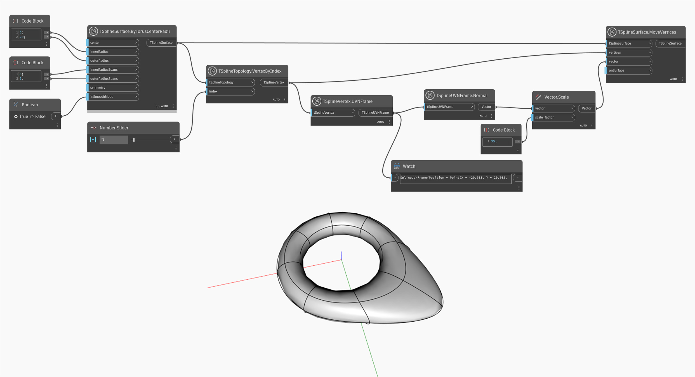

## In-Depth
Ce noeud renvoie un objet TSplineUVNFrame qui peut être utile pour visualiser la position et l'orientation du sommet, ainsi que pour utiliser les vecteurs U, V ou N pour manipuler davantage la surface de T-Spline.

Dans l'exemple ci-dessous, le noeud `TSplineVertex.UVNFrame` permet d'obtenir le cadre UVN du sommet sélectionné. Le cadre UVN est ensuite utilisé pour renvoyer la normale du sommet. Enfin, la direction de la normale est utilisée pour déplacer le sommet à l'aide du noeud `TSplineSurface.MoveVertices`.

## Exemple de fichier

