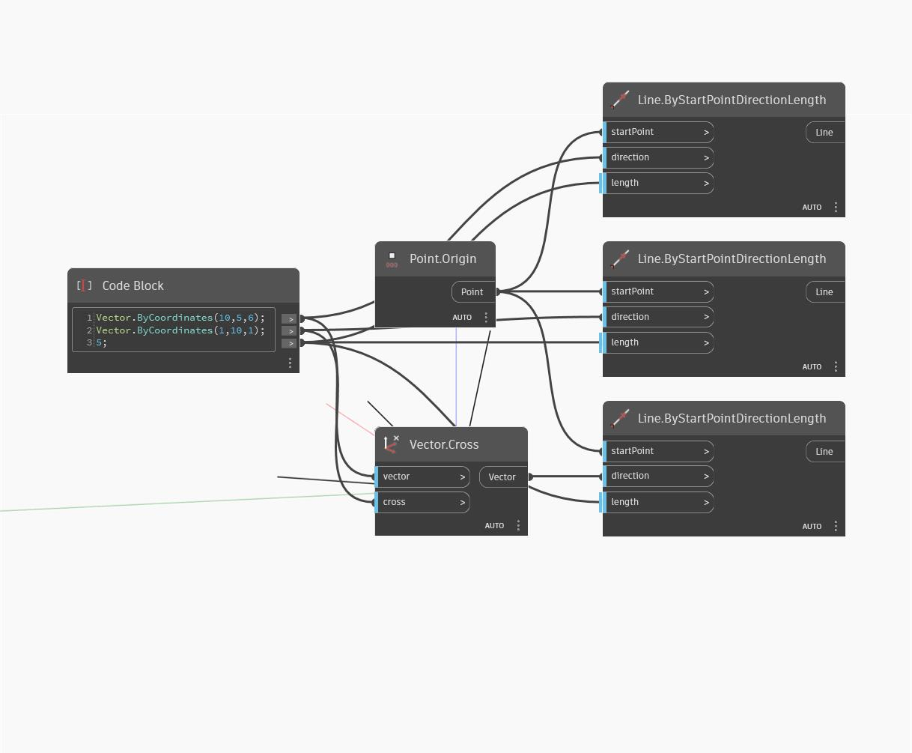

## Description approfondie
Cross renvoie le produit cartésien de deux vecteurs. Dans l'exemple ci-dessous, le produit cartésien de deux vecteurs génère un nouveau vecteur. Les vecteurs sont représentés par des lignes.
___
## Exemple de fichier

