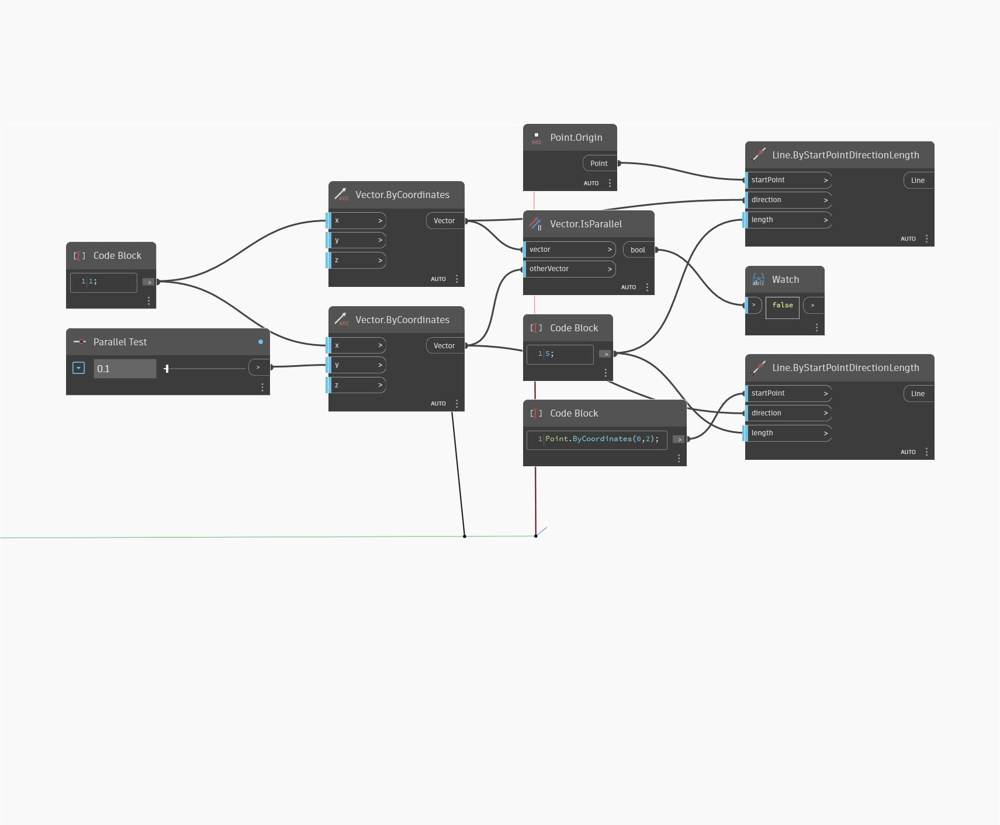

## Description approfondie
IsParallel renvoie une valeur booléenne indiquant si un vecteur est parallèle ou non à un autre vecteur. Dans l'exemple ci-dessous, deux vecteurs représentés sous forme de lignes sont comparés. Ajustez le curseur pour faire pivoter un vecteur parallèlement l'un à l'autre.
___
## Exemple de fichier

