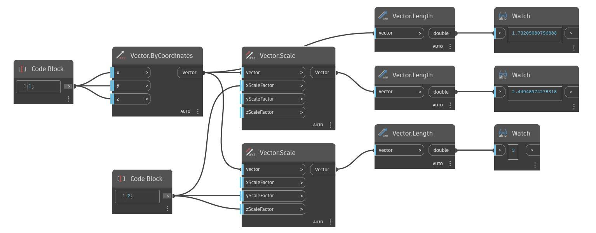

<!--- Autodesk.DesignScript.Geometry.Vector.Scale(xScaleFactor, yScaleFactor, zScaleFactor) --->
<!--- CCR7BJ5XIJULEXEPYBKPPRN72GCPWJFM6VM5D7WFWVQPPL62SAJQ --->
## Description approfondie
Met le vecteur à l'échelle autour de l'origine de façon non uniforme.
___
## Exemple de fichier

