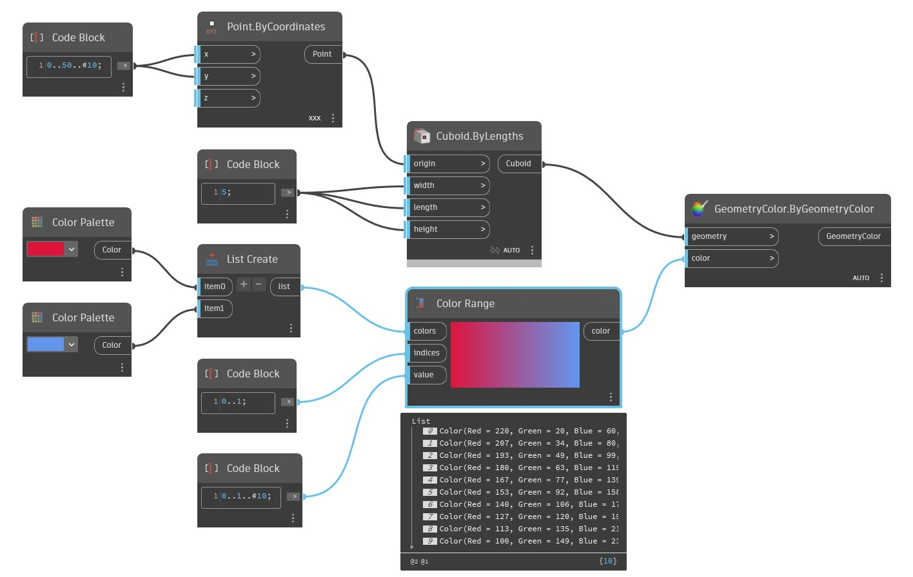

## Description approfondie
ColorRange crée un dégradé entre un jeu de couleurs d'entrée et permet de sélectionner les couleurs de ce dégradé dans une liste de valeurs d'entrée. La première entrée, colors, est une liste de couleurs à utiliser dans le dégradé. La seconde entrée, indices, détermine l'emplacement relatif des couleurs d'entrée dans le dégradé. Cette liste doit correspondre à la liste des couleurs, chaque valeur étant comprise entre 0 et 1. Peu importe la valeur exacte, c'est la position relative des valeurs qui compte. La couleur correspondant à la valeur la plus basse se trouve à gauche du dégradé et la couleur correspondant à la valeur la plus élevée se trouve à droite du dégradé. La saisie des valeurs finales permet à l'utilisateur de sélectionner des points le long du dégradé dans la plage de 0 à 1 pour la sortie. Dans l'exemple ci-dessous, nous créons d'abord deux couleurs: le rouge et le vert. L'ordre de ces couleurs dans le dégradé est déterminé par une liste créée avec un Code Block. Un troisième Code Block est utilisé pour créer une plage de nombres comprise entre 0 et 1 qui détermine les couleurs de sortie du dégradé. Un jeu de cubes est généré le long de l'axe x. Ces cubes sont finalement colorés en fonction du dégradé à l'aide d'un nœud Display.ByGeometryColor.
___
## Exemple de fichier

